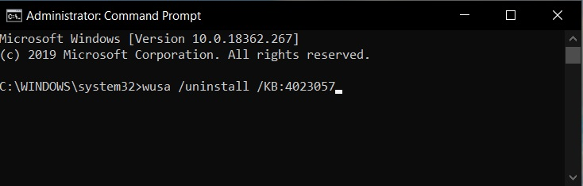
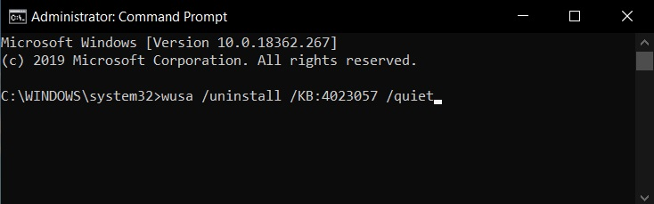
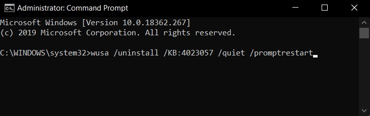
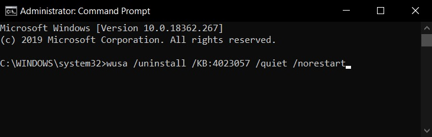
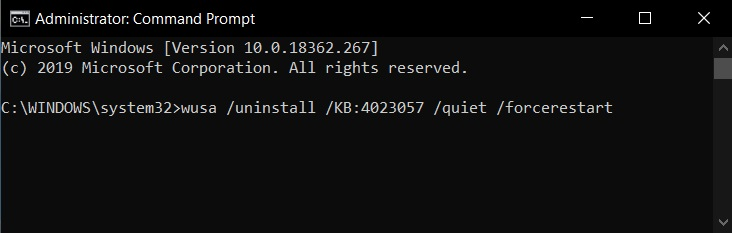

# Windows Updates - Uninstall

## Simple Uninstall
To uninstall an update, open an Elevated Command Prompt (admin) and then type the following command after replacing the KB ID with the one that you wish to uninstall: **wusa /uninstall /kb:[id]**

**Example:** wusa /uninstall /KB:4023057

## Quiet Uninstall
If you want to uninstall the update without your interaction and automatically restart the computer, you would use the following command: **wusa /uninstall /kb:[id] /quiet**

**Example:** wusa /uninstall /KB:4023057 /quiet

## Prompt Restart
If you want to uninstall the update and prompt to restart the computer, use the following command: **wusa /uninstall /kb:[id] /quiet /promptrestart**

**Example:** wusa /uninstall /KB:4023057 /quiet /promptrestart

## No Restart
If you want to uninstall the update without a forced system reboot, use the following command: **wusa /uninstall /kb:[id] /quiet /norestart**

**Example:** wusa /uninstall /KB:4023057 /quiet /norestart

## Force Restart
If you want to uninstall the update and force system reboot, use the following command: wusa /uninstall /kb:[id] /quiet /forcerestart

**Example:** wusa /uninstall /KB:4023057 /quiet /forcerestart

### Source :
[Bleeping Computer - Uninstall Windows Updates - 2019/08/05](https://www.bleepingcomputer.com/news/microsoft/how-to-uninstall-windows-10-updates-manually/)
